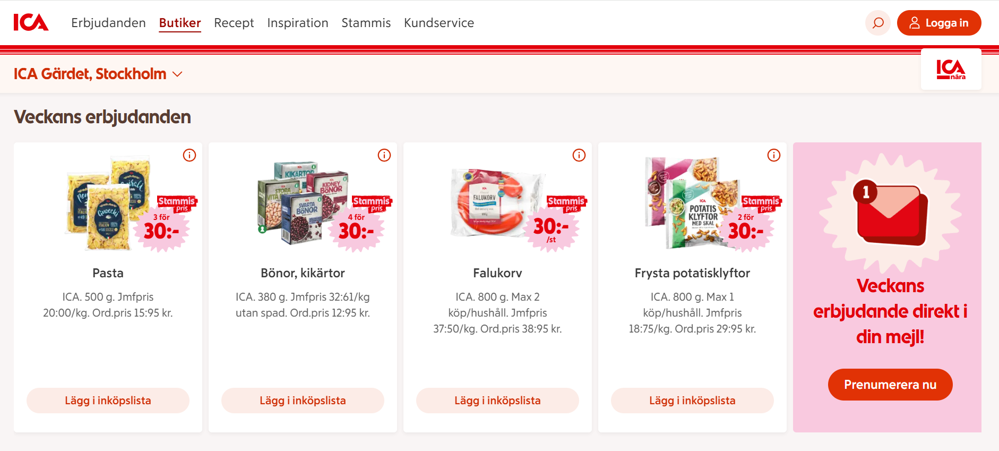
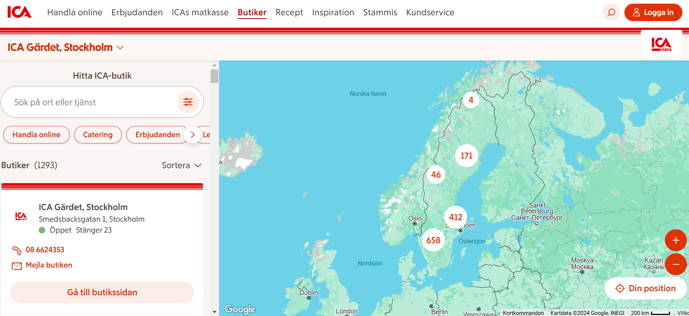

# AI-Lunch-Box: a recomender system

This application scrapes your local ICA store for the weeks best deals, then provides you with a shopping list together with AI generated recepies. You will never have to plan your lunchbox or miss a good deal again!

[](LICENSE)
[](https://github.com/cajjster/lunch_box_planner/stargazers)
[](https://your-live-demo-link.com)

---

## Table of Contents

1. [About the Project](#about-the-project)
2. [Getting Started](#getting-started)
3. [Usage](#usage)
4. [Features](#features)
5. [Contributing](#contributing)
6. [License](#license)
7. [Acknowledgments](#acknowledgments)

---

## About the Project

The project began during the recent inflation spikes. With increased costs of groceries and eating out many people have reverted to bringing a lunch box to work. 

This ofcourse, is time consuming. Picking recepies to cook and making a shopping list for the week can be daunting. Furthermore, how do we make sure that we get the best groceries for our week at the best price?

Enter AI-Lunch-Box. 

This application scrapes any of your local ICA grocery stores in order to get this weeks best deals on groceries. 
This information is then passed to OpenAI's chat-gpt together with predefined prompts in order to return to the user a shopping list and cooking instructions. It can also send the information to the phone number of your choice, allowing you to use the information from a handheld device (ex. during cooking or shopping) as well as offline.

This application is unique in catering to Swedish users and tastes but is modular to allow for other languages, units and eventual preferences. There are many possibilities for further customisation and addition of new features.

Join AI-Lunch-Box today!


### Screenshots

ICA grocery store weekly deals are the basis for the application.  




---
The user may choose local store from any of the hundreds of available ICAs in Sweden. 



## Getting Started

To get started with this application. Follow the step-by step guide below. 

### Prerequisites

List tools and dependencies needed:
- Python 3.10+
Libraries used:
- selenium
- requests
- bs4 - BeautifulSoup
- openai
- twilio.rest
- os
- dotenv

Other requirements:
-pip install
-pipenv


### Installation

Provide clear installation steps:

```bash
# Clone the repo
git clone https://github.com/yourusername/repo.git

# Navigate to the project directory
cd repo

# Install dependencies
pip install -r requirements.txt
```

## Features

Highlight key features:

- 📊 Interactive visualizations
- ⚡ Real-time updates
- 🔐 Secure authentication
- 🌍 Localization support

## Contributing

Contributions are welcome! Please follow these steps:

1. Fork the repository.
2. Create your feature branch (`git checkout -b feature/new-feature`).
3. Commit your changes (`git commit -m 'Add new feature'`).
4. Push to the branch (`git push origin feature/new-feature`).
5. Open a pull request.

Refer to [CONTRIBUTING.md](CONTRIBUTING.md) for detailed guidelines.

---

## License

Distributed under the MIT License. See `LICENSE` for more information.

## Acknowledgments

If there are any
